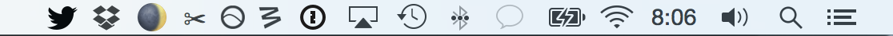

# mooon

[](https://greenkeeper.io/)


[![npm][npm-image]][npm-url]
[![travis][travis-image]][travis-url]
[![david][david-image]][david-url]

[npm-image]: https://img.shields.io/npm/v/mooon.svg?style=flat-square
[npm-url]: https://www.npmjs.com/package/mooon
[travis-image]: https://img.shields.io/travis/bcomnes/mooon.svg?style=flat-square
[travis-url]: https://travis-ci.org/bcomnes/mooon
[david-image]: https://img.shields.io/david/bcomnes/mooon.svg?style=flat-square
[david-url]: https://david-dm.org/bcomnes/mooon




Displays the moon phase in your staus bar/tray

Builds fine.  Still working on a packaging workflow.

## Install

```
npm install mooon
```

## Usage

```js
var mooon = require('mooon')
```

## Contributing

[Open-2](CONTRIBUTING.md)

## License

[ISC](LICENSE.md)
